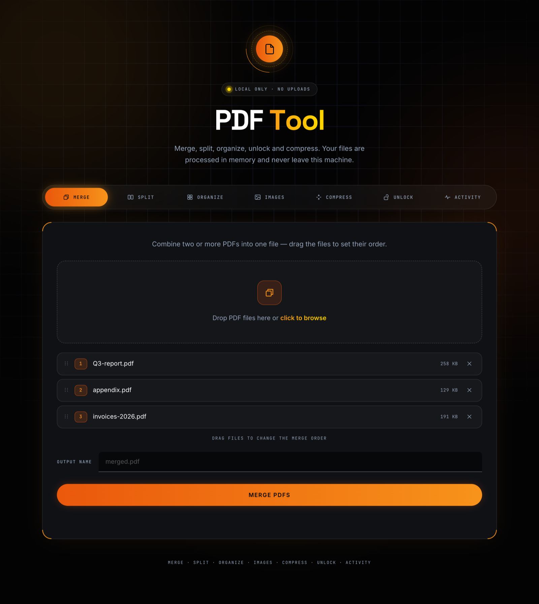
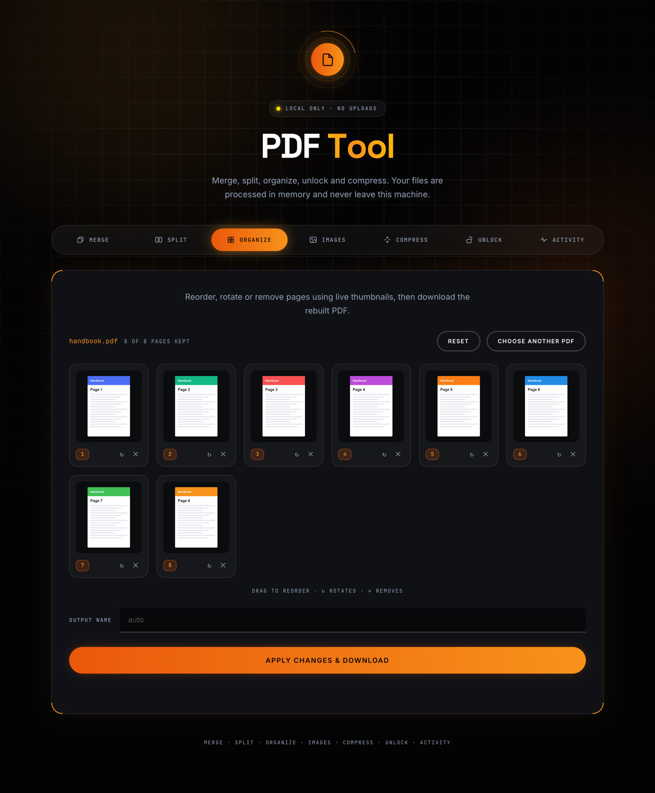
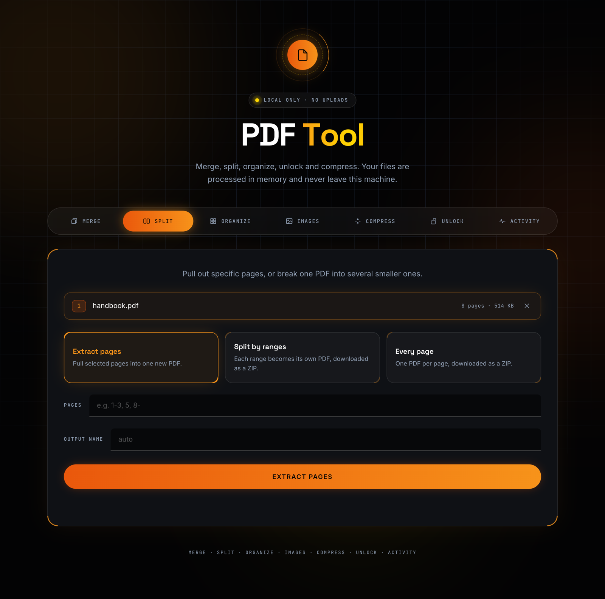
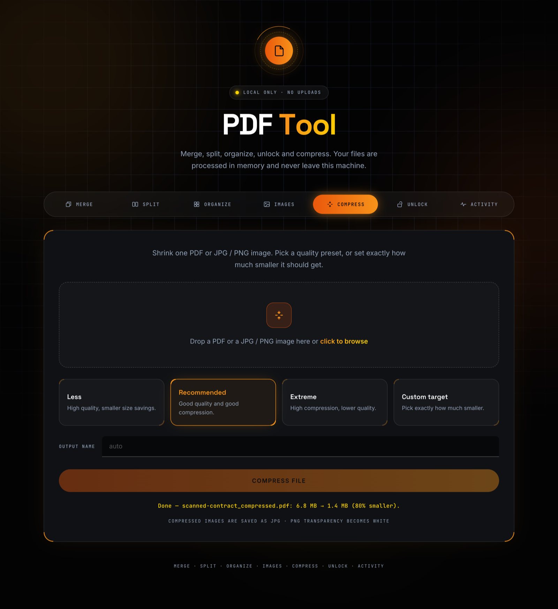
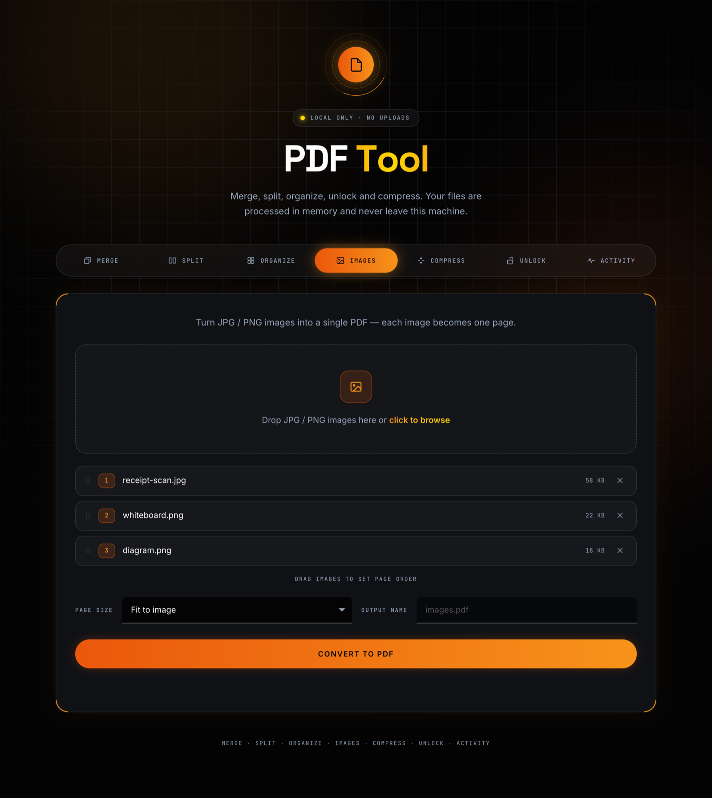
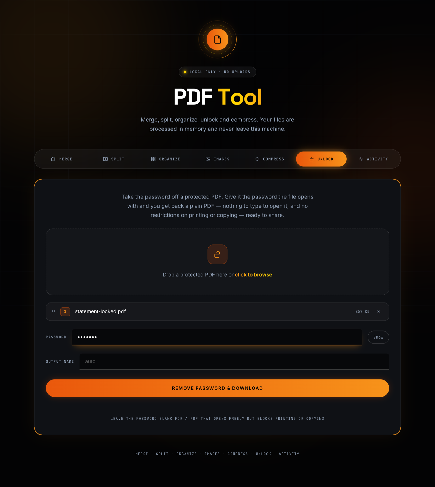
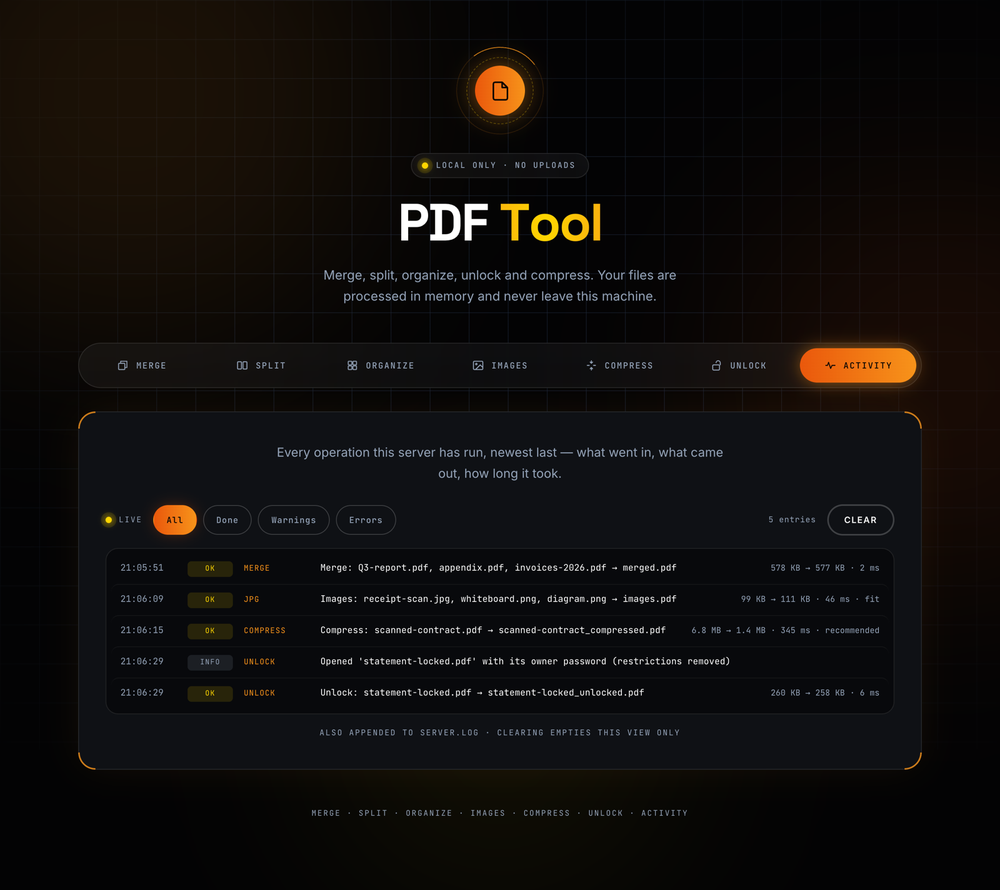

# PDF Tool

A small, private PDF toolkit that runs entirely on your own computer. Merge,
split, reorder, compress and unlock PDFs, and turn images into PDFs, all from a
browser tab. Nothing is uploaded anywhere. Files are processed in memory by a
local server and go straight back to your Downloads folder.



## Features

| | |
|---|---|
| **Merge** | Combine two or more PDFs. Drag the files into the order you want. |
| **Split** | Extract pages (`1-3, 5, 8-`) into a new PDF, split by ranges into several PDFs, or save every page separately (as a ZIP). |
| **Organize** | Reorder, rotate and delete pages using live page thumbnails. |
| **Images** | Turn JPG/PNG images into a PDF, one page per image, at image size, A4 or Letter. |
| **Compress** | Shrink a PDF or image with a preset (*Less*, *Recommended*, *Extreme*) or a custom target such as "50% smaller". |
| **Unlock** | Remove the password and the print/copy/edit restrictions from a PDF *you already know the password to*. |
| **Activity** | A live log of every operation: files in, file out, sizes, timing, and the reason for anything rejected. |

It works offline. pdf.js, anime.js and the fonts are bundled in the repo, so
nothing is loaded from a CDN.

## Screenshots

<table>
  <tr>
    <td width="50%"><br><sub><b>Organize</b>: drag thumbnails to reorder, rotate or remove pages</sub></td>
    <td width="50%"><br><sub><b>Split</b>: extract pages or split into several files</sub></td>
  </tr>
  <tr>
    <td><br><sub><b>Compress</b>: a 6.8 MB scan down to 1.4 MB with the Recommended preset</sub></td>
    <td><br><sub><b>Images</b>: JPG/PNG to PDF, one page per image</sub></td>
  </tr>
  <tr>
    <td><br><sub><b>Unlock</b>: remove a known password and restrictions</sub></td>
    <td><br><sub><b>Activity</b>: what ran, what came out, how long it took</sub></td>
  </tr>
</table>

## Requirements

- **Python 3.9 or newer** (`python3 --version` to check)
- A modern browser (Chrome, Edge, Firefox or Safari)
- macOS or Linux. On Windows, see [Running manually](#running-manually).

## Getting started

```bash
git clone https://github.com/samahitha03/pdf-tool.git
cd pdf-tool
./run.sh
```

On the first run, `run.sh` creates a Python virtual environment in `.venv/` and
installs the dependencies (Flask, pypdf, Pillow, cryptography). This takes
about 30 seconds and only happens once. Then the server starts and your browser
opens the tool at `http://127.0.0.1:5177`.

Press `Ctrl+C` in the terminal to stop it. The server also shuts itself down
after 10 minutes with no open tab.

### The `pdftool` command (optional)

`pdftool` runs the tool in the background so it doesn't hold a terminal open:

```bash
./pdftool          # start (if needed) and open it in the browser
./pdftool status   # is it running?
./pdftool stop     # stop it
```

To run it from anywhere, link it onto your `PATH`:

```bash
ln -s "$PWD/pdftool" ~/.local/bin/pdftool   # or /usr/local/bin
```

It finds the project folder through the link, so the clone can live anywhere.

### Running manually

If `run.sh` doesn't suit your system (for example, on Windows):

```bash
python -m venv .venv
.venv\Scripts\activate          # Windows; use `source .venv/bin/activate` elsewhere
pip install -r requirements.txt
python app.py
```

## Using it

1. Pick a tool from the tab bar.
2. Drop files onto the drop zone, or click it to browse.
3. Adjust the options (page ranges, order, preset, password…) and optionally
   set an output file name.
4. Click the action button. The result downloads through your browser, and the
   drop zone clears for the next job.

**Tips**

- **Page ranges** in Split accept `1-3, 5, 8-`. An open range like `8-` runs
  to the last page.
- **Compress** returns the original file unchanged if it can't be made
  smaller. Compressed images are saved as JPG, so PNG transparency becomes
  white.
- **Unlock**: for a PDF that opens without a password but blocks printing or
  copying, leave the password blank. Unlock does not guess or crack unknown
  passwords. Passwords are used for that one request and are never logged.
- Other tools reject password-protected PDFs. Unlock them first.

## Privacy and security

- The server listens on `127.0.0.1` only, so other machines on your network
  can't reach it.
- Uploaded files are processed in memory and are never written to disk by the
  server.
- Each launch creates a random session key, kept in memory. The browser tab
  the launcher opens gets the key and swaps it for a cookie. The server
  rejects requests without the key, from other websites (`Origin` check), or
  addressed to another host name (DNS-rebinding check). Other web pages and
  local programs therefore can't drive the tool or read its activity log.

Because the key changes each launch, a tab left open across a restart (or a
bookmark) shows a "this tab isn't signed in" page. Relaunch to fix it:

```bash
./pdftool stop && ./pdftool
```

If the browser doesn't open on its own, `run.sh` prints a link containing the
key to the terminal.

## Configuration

Two optional environment variables:

| Variable | Default | Meaning |
|---|---|---|
| `PDF_TOOL_IDLE_TIMEOUT` | `600` | Seconds with no open tab before the server exits |
| `PDF_TOOL_MAX_CONTENT_LENGTH` | `52428800` (50 MB) | Largest upload accepted per request, in bytes |

```bash
PDF_TOOL_MAX_CONTENT_LENGTH=209715200 ./run.sh   # allow 200 MB uploads
```

The port is fixed at `5177` (`PORT` in `app.py`).

## Project layout

```
app.py               Flask server and all PDF/image processing
run.sh               Launcher: sets up .venv on first run, starts the server
pdftool              Background start / stop / status helper
requirements.txt     Python dependencies
static/index.html    The whole UI (one file, no build step)
static/icon.svg      App mark; favicon.svg is a simplified cut for the tab
static/vendor/       pdf.js, anime.js and webfonts, bundled for offline use
docs/DESIGN.md       Notes on the UI, motion, sessions and logging
docs/screenshots/    Images used in this README
```

`server.log` (the activity log) is created at runtime. It is gitignored and
rotates at 1 MB.

### API

The UI talks to these endpoints, which all take `multipart/form-data`:
`/api/merge`, `/api/split`, `/api/organize`, `/api/jpg-to-pdf`,
`/api/compress` and `/api/unlock`. `/api/logs` serves the activity feed.
Every request must carry the session key described above.

## Troubleshooting

| Problem | Fix |
|---|---|
| "This tab isn't signed in to PDF Tool" | The server restarted. Run `./pdftool stop && ./pdftool`. |
| Port 5177 already in use | Run `./pdftool stop`, or find the process with `lsof -i :5177`. |
| "Page previews unavailable" in Organize | pdf.js didn't load. Do a hard refresh, and check that `static/vendor/pdf.min.mjs` exists. |
| File too large | Raise `PDF_TOOL_MAX_CONTENT_LENGTH` (see [Configuration](#configuration)). |
| Something failed | Open the **Activity** tab, or read `server.log`, for the reason. |

## Third-party code

Bundled in `static/vendor/`, each with its license file alongside:

- [pdf.js](https://github.com/mozilla/pdf.js) by Mozilla, Apache-2.0
- [anime.js](https://github.com/juliangarnier/anime) by Julian Garnier, MIT
- [Inter](https://rsms.me/inter/), [Space Grotesk](https://github.com/floriankarsten/space-grotesk)
  and [JetBrains Mono](https://www.jetbrains.com/lp/mono/), SIL Open Font License

Python dependencies: [Flask](https://flask.palletsprojects.com/),
[pypdf](https://github.com/py-pdf/pypdf), [Pillow](https://python-pillow.org/)
and [cryptography](https://cryptography.io/).
